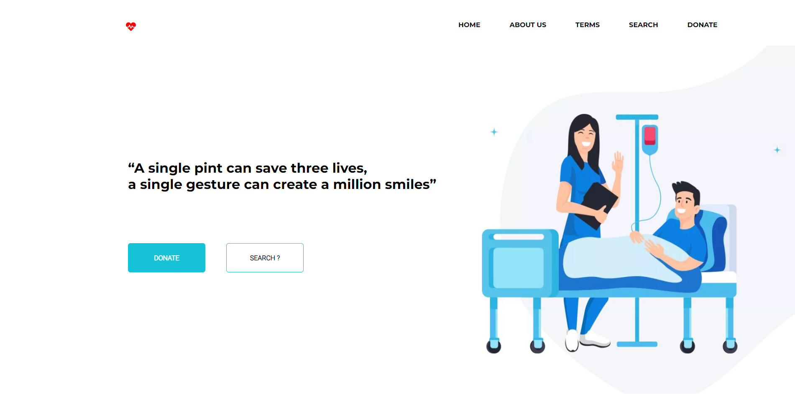
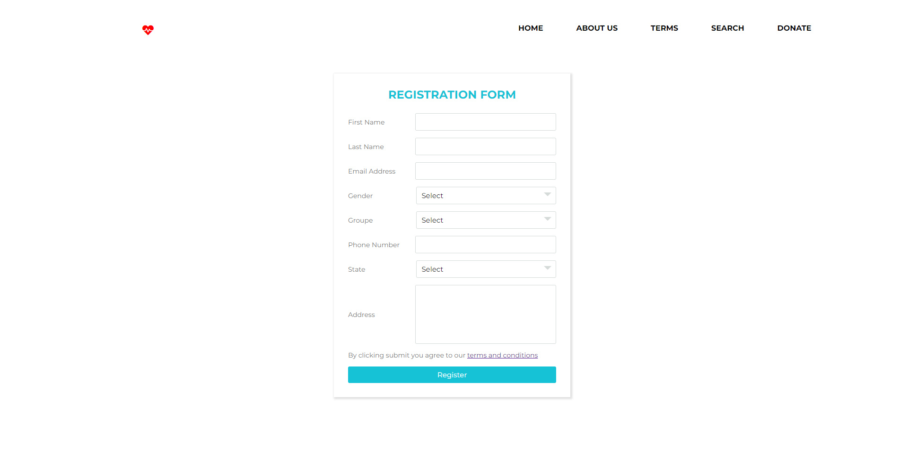
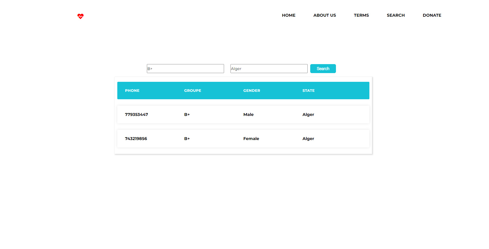

<h1 align="center">
  BloodDonation
   
</h1>

<h3 align="center">
BloodDonation aims to connect those who need blood and those who can donate blood, which saves the trouble of searching.
</h3>
 

<h4 align="center">
Home Page
</h4>

 

# Technical Details
This application is web-based, For all the front-end components, [ReactJs](https://reactjs.org/). The application is essentially split into ReactJs for the frontend amd [NodeJs](https://nodejs.org/) for the backend and [MySql](https://www.mysql.com/) for the DataBase.

# Roadmap
BloodDonation is still very much a work-in-progress. We will be adding new features and bug-fixes often, but this is a hobby project for the core-contributors, so the time that we can spend on it is limited.

For all our feature and bug tracking, we use the [Issues Section](https://github.com/AzouKr/BloodDon-Client/issues). BloodDonation's 'roadmap' is currently to work through the feature requests and improvements that are in the issue tracker.  Take a look at the milestones for what we intend to add for upcoming releases.

# Some Images

  

  

 
